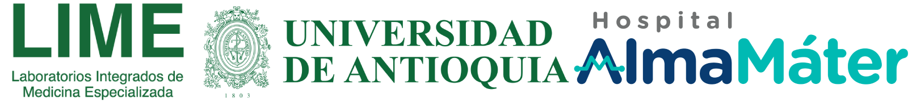

# Laboratorios Integrados de Medicina Especializada (UT LIME)

LIME (Laboratorios Integrados de Medicina Especializada) surge de la unión entre la **Universidad de Antioquia** y el **Hospital Alma Máter**, consolidando décadas de investigación aplicada para ofrecer diagnósticos innovadores y personalizados.

Como empresa universitaria de base científica y tecnológica, LIME desarrolla productos y servicios orientados a mejorar la atención en salud, especialmente en enfermedades:

- Raras
- Crónicas
- Infecciosas
- Oncológicas

Además, apoya a las industrias farmacéutica, alimentaria y nutricional mediante:

- Analítica de datos
- Ensayos clínicos
- Validación de estándares internacionales

## Enfoque de este repositorio

Este repositorio centraliza iniciativas de **desarrollo de software** que soportan la operación clínica, diagnóstica, administrativa y de innovación de LIME.

El objetivo es habilitar una arquitectura modular que permita:

- Escalar productos digitales por dominio
- Integrar procesos de laboratorio y gestión
- Fortalecer trazabilidad, calidad y oportunidad del dato
- Acelerar el despliegue de nuevos servicios de salud digital

## Capacidad diagnóstica y respuesta en Covid-19

LIME ha mantenido disponibilidad operativa para atender la demanda de pruebas de Covid-19, incluyendo:

- Pruebas de antígeno
- PCR cuantitativa
- PCR LAMP (resultados rápidos en alrededor de 15 minutos)

Según el tipo de prueba y la demanda operativa, los resultados se entregan en tiempos que pueden ir desde **15 minutos hasta 2 días**.

## Contacto y agendamiento

- **WhatsApp LIME:** 304 326 3106
- **Sede principal de toma de muestras:** segundo piso de la IPS Universitaria Ambulatoria en Prado
- **Modalidad adicional:** toma de muestra con visita domiciliaria (previa agenda)

## Propósito tecnológico

El ecosistema de software de LIME está orientado a articular investigación, diagnóstico y operación asistencial en una plataforma digital evolutiva, con foco en:

- Interoperabilidad
- Calidad de datos
- Seguridad clínica
- Tiempo de respuesta para la atención en salud
